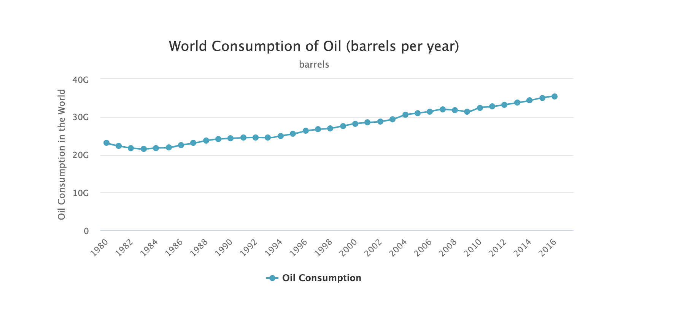
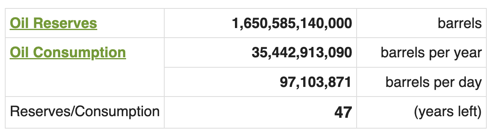
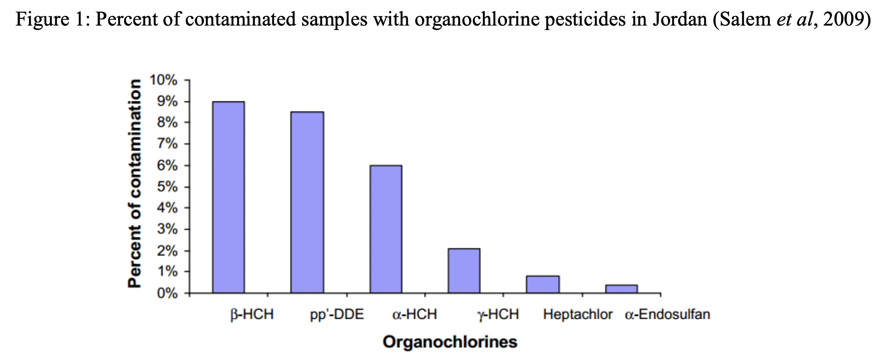
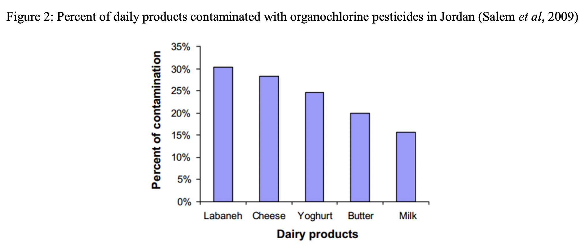

# Welcome to My Blog for Environmental Protection

Writer: Haohan Zou
Date: June 1st, 2022

## Abstract
 
Currently, we are in a position where we have to do something to save our environments. However, with so many existing facts of our deteriorating climate systems, people don't show any signs that they are going to make some changes. In this blog, I will present some analysis on why human don't make any reactions and what kinds of effective strategies we could use to save the Earth.

## Background
* Facts:
    * Nasa’s Goddard Institute announces that average temperature has been warmed by 1 degree Celsius since the industrial revolution, and it is increasing with the speed at 0.2 degree Celsius per decade, causing the rise of sea level, glacial melting and so on.

        
    
    * According to reports from MAHB of Stanford University, if human keep the current rate of exploitation and consumption of natural resources, the preliminary energy such as fossil fuel and gas will run out within 30 to 50 years, leading to severe energy depletion, and impeding the further development of our society.
    
    
    * . In the 1970s, through experiments, scientists realized the harmful effects to environments and human health from some chemical agents even at very low concentrations such as DDT and CFCs. 
    
    
    * in the late 1980s, research had shown that the improving concentration of carbon dioxide and other greenhouse gasses were having significantly negative influences on many aspects.
     :max_bytes(150000):strip_icc():format(webp)/polar-bear--repulse-bay--nunavut--canada-599854185-8b4910efbb1a4a56b8f2ef01941d4baf.jpg)

* Public's reaction:
    * The 3rd phrase of industrial revolution is operating at full speed within many developing countries. 
    * Industries still drain water containing huge amounts of chemical agents into rivers and oceans, disrupting the reproduction of fish and birds and depleting the stratospheric ozone layer. 
    * Human still continue their activities such as intensive exploitation, fossil fuel combustion, and concrete manufacture, emitting toxic gases and forcing people to wear masks for personal health protection. 
   

* Situation Analysis:

    * **Finding information**- without an accurate clock under the context of nature, human are out of sync with changes happening in environments.
    * **Expressing information** - scientists’ failure of showing the full-scale picture of climate changes and connecting human activities with this crisis leads to public's overlook of environmental crisis.
    * **Accepting information** - Human’s irrationality of connecting science with personal identities as the main reason that causes the polarization on popular topics such as the environmental crisis.


  

## Goal
In the presentation "Connecting Global Change to Local Impacts & Solutions", Katharine expresses the idea that people care about environments because they are affected by the crisis. As a result, to appeal people's concerns to our climate systems, it's necessary to connect people's value to environmental problems by telling them what kinds of bad effects are taking place within their communities. In this blog, I'm going to use this idea by listing the environmental problems happening in our local area - San Diego. Though it's hardly for me to bring any big impacts on people's thoughts, I hope to improve our local people's awareness and give them several practical strategies to remedy current situations.


## Environemtnal Problems in San Diego

* Local community organization


## General Strategies


## Additional Sources
* [This is the video where I get the idea of protection local environments.](https://www.youtube.com/watch?v=FHkZ7aOE3hQ)

*  This is the information of research which introduces the idea of disentanglement principle:
    ```
    Title: What is the "science of science communication"?
    Author: Dan M. Kahan
    ```
    Here's the link to access this research: [click here.](https://haohanzou.github.io/syn1-project-3/Article-disentanglement-principle) 
*  This is the information of article talking about time confusion.
    ```
    Title: Fatally Confused: Telling the Time in the Midest of Ecological Crises
    Author: Michelle Bastian
    ```

* This is the information of book which explains how scientists and policy-makers are responsible for our current climate crisis.
    ```
    Title: The Collapse of Western Civilization: a View from the Future
    Author: Oreskes Naomi, Conway M Erik
    ```

    Here is a availabe link to access this book: [click here.](https://search-library.ucsd.edu/discovery/fulldisplay?context=L&vid=01UCS_SDI:UCSD&search_scope=ArticlesBooksEtc&tab=ArticleBooksEtc&docid=alma991023411578806535)


 


